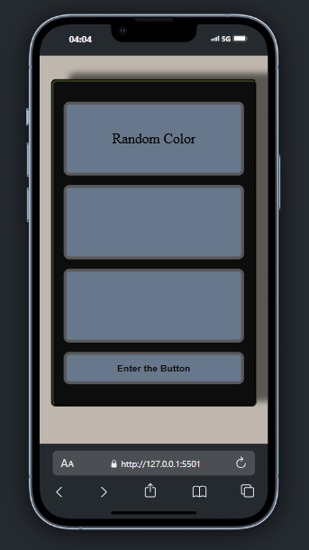
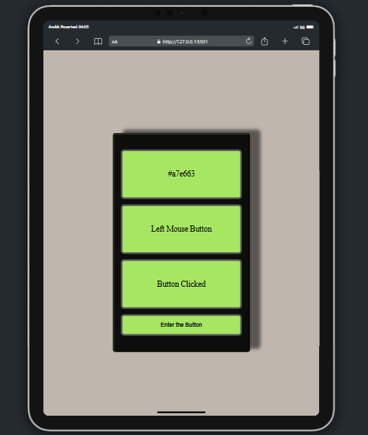
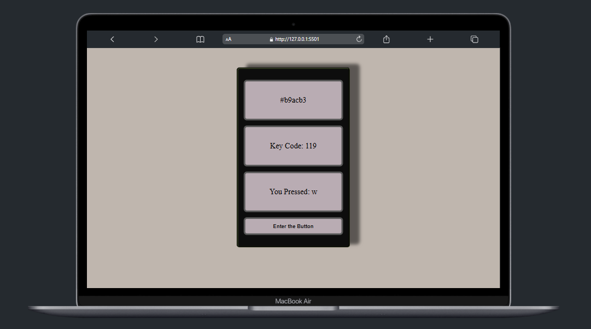

# DOM Interactions with CSS

## Demo

## ScreenShots

## Description

A dynamic web application that uses HTML, CSS, and JavaScript to create an interactive user experience. The page responds to keypresses and button clicks by displaying relevant information and dynamically changing background colors.

## Features

- Displays a random color code and updates the background color dynamically.
- Shows the ASCII code and name of any key pressed on the keyboard.
- Responds to button clicks with random color updates and interaction feedback.
- Fully responsive design, optimized for both mobile and desktop devices.

## Technologies Used

- **HTML5**: Structuring the webpage.
- **CSS3**: Styling and responsive design.
- **JavaScript (ES6+)**: Dynamic DOM manipulation and user interaction handling.

## Usage

1. **Keyboard Interaction**:
   - Press any key to see its ASCII code and name displayed on the page.
   - Background colors of the sections and button change to random colors.
2. **Button Interaction**:
   - Click the button to trigger random color changes.
   - Displays "Button Clicked" along with specific feedback for mouse clicks (e.g., "Left Mouse Button").

## Responsive Design

- **320px and below**: The container occupies the full screen.
- **834px and below**: The container adjusts to 50% of the screen width.

## License

This project is licensed under the [MIT License](LICENSE).
